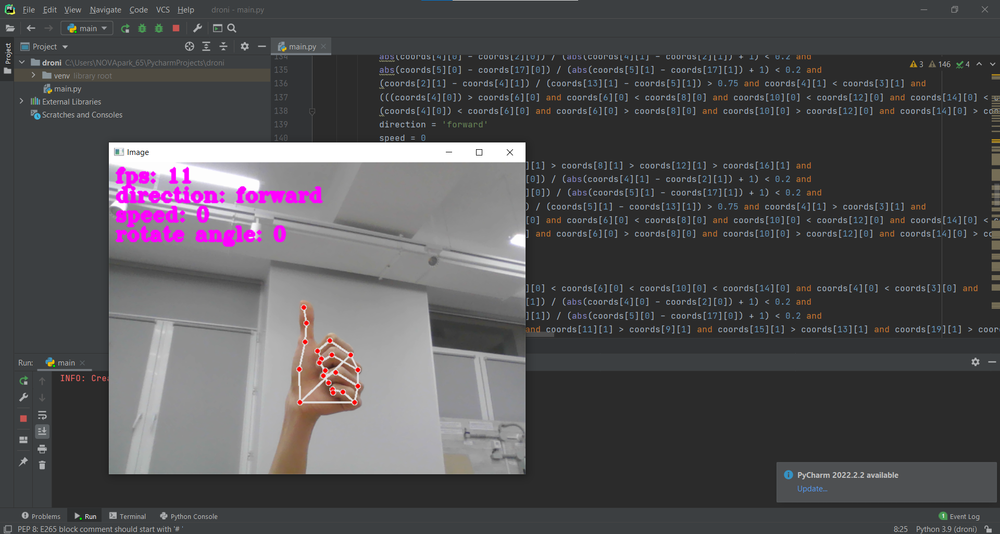
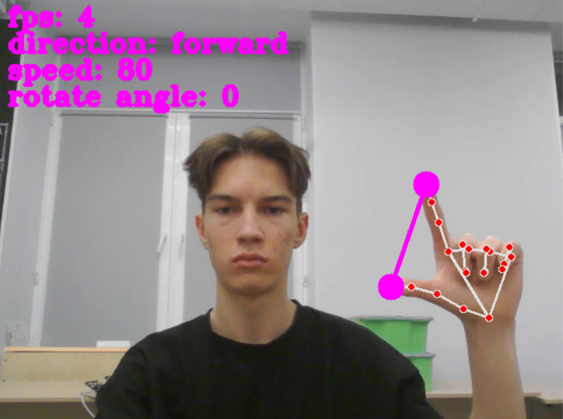

# djitellopy-gestures

<div>
    
    
</div>

# About the project

My old school project. In the project I created a gesture system with the help of which you can control a drone with your hands. The project has full documentation in russian language.

I've shown my project in many different conferences:
- Большие вызовы
  - Final-stage participant [№100220240510092769](https://sochisirius.ru/uploads/2024/04/%D0%A1%D0%BF%D0%B8%D1%81%D0%BE%D0%BA_%D1%83%D1%87%D0%B0%D1%81%D1%82%D0%BD%D0%B8%D0%BA%D0%BE%D0%B2_2_%D1%82%D1%83%D1%80%D0%B0_%D0%BE%D0%B1%D0%BD%D0%BE%D0%B2%D0%BB%D0%B5%D0%BD%D0%BD%D1%8B%D0%B9_%D0%B2%D0%B0%D1%80%D0%B0%D0%B8%D0%BD%D1%82.pdf)
- Юные дарования 21 века
  - [3rd place](https://ibb.co/twGHCy8s)
- Юные Техники и Изобретатели
- Высший пилотаж
- XIX Королевские чтения: школьники
- Наука. Смелость. Изобретения

# Main functions

- Control a drone with hand gestures

# Used in project

- Python 3.8+
- Djitellopy - for controlling a drone
- Opencv - for computer vision

# Downloading and running the bot

### 1. Download [Python](https://www.python.org/) and IDE

You can use any IDE you want, for example: PyCharm, VSCode, Python IDLE, etc.

### 2. Download ZIP or use git clone

```bash
git clone https://github.com/middelmatigheid/djitellopy-gestures.git
cd aiogram-guide
```

### 3. Create virtual environment

If you are using Linux/MacOS

```bash
python -m venv venv
source venv/bin/activate
```

If you are using Windows

```bash
python -m venv venv
venv\Scripts\activate 
```

### 4. Install requirements

```bash
pip install -r requirements.txt
```

### 5. Run the program

```bash
python main.py
```

# Project structure

```bash
djitellopy-gestures/
├── main.py               # Main file to run the bot
├── documentation         # All documentation                 
└── requirements.txt      # Python requirements
```


